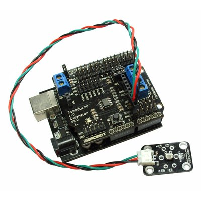
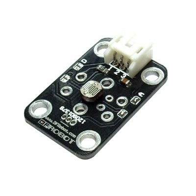

Processor
.........

There are many possibilities.  I'll narrow to arduino, but even then there are many.  One is

* http://www.robotshop.ca/dfrobot-dfrduino-usb-microcontroller-atmega328-4.html

just for example.   It takes 6 analog inputs, which is fine.  It's USB compatible (I guess) but so, it seems, are most of them.  One thing is that it says it can work with C.  Another one (http://www.robotshop.ca/arduino-uno-microcontroller.html) I looked at seems to be mainly for robots.

Software
........

http://arduino.cc/en/Main/Software

Light sensor
............

* http://www.robotshop.ca/dfrobot-ambient-light-sensor-1.html

$5.10 Cds.  Analog.  Interfaces to microcontrollers.  3-pin PCB connector

