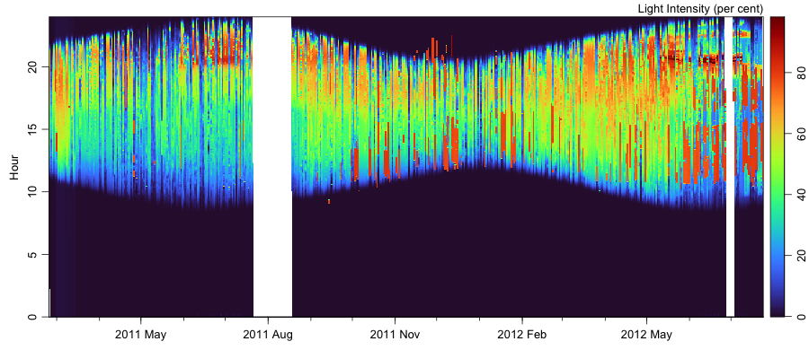

See also: [introduction](index.md) and [methods](methods.md).

# Weather

The graph shown below indicates recent variations in light intensity in an
office in Halifax, Nova Scotia.   The sensor is placed on a desk, pointing
upwards, and shaded from direct sunlight.  The (rare) use of lights in the
office is indicated by near-constant light levels of 80 percent.

The image is color-coded for intensity and shown as a function of the hour of
the day and the day of the year.  It is created at a 10-minute interval with
the R script <a href="code/weather_image.R">weather_image.R</a>.  The white
regions of the image correspond to times when the sensor was disconnected from
the logging computer.

# Solar navigation

A couple of days of clear sunrise and sunset can be sufficient to navigate
infer an observation location to within a few hundred kilometers (see Section
5.9 of Kelley, Dan E. Oceanographic Analysis with R. New York: Springer-Verlag,
2018.  https://www.springer.com/us/book/9781493988426).  Even the shad-affected
       observations made in author\'s office can provide a reasonable estimate,
if a longer time interval is used, as illustrated below.

The graph shown above is the result of early tests with automatic detection of
sunrise and sunset times.

The graph shown below indicates the observation location in Halifax, Nova
Scotia, along with an inference of that location based on sunrise and sunset
times.  Both graphs are made by an R script called
[solar_navigation.R](code/solar_navigation.R), which is run twice per day.
Before the new building turned the office into a dark cave, the graph below
would have a red circle somewhat near the blue square, except within a week or
so of the equinoxes, when the solar navigation method fails.

# Sensor calibration

The graph below shows a calibration between two sensors placed near each other.
It seems reasonable to take the main shape as a measure of inter-sensor
differences, although the detailed trajectories in the calibration space may
also relate to differences in light intensity at the two sensors, since they
are nestled between various bits of equipment on a table, and one is sometimes
in brighter light than the other, as light passes through the room through the
course of the day.  The graph is created by an R script called
href=[calibration.R](code/calibration.R)

